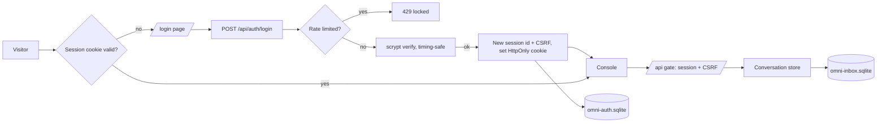
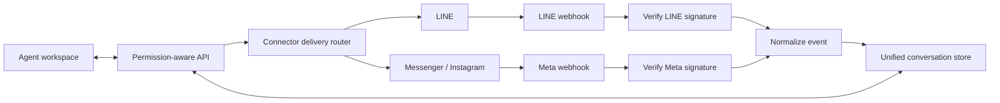

# Architecture

## Runtime

- Frontend: static HTML, CSS, and JavaScript served by Express.
- Backend: Node.js and Express.
- Persistence: SQLite with WAL, full synchronous commits, SHA-256 state verification, 100 in-database snapshots, and 50 external recovery copies.
- Connectors: LINE Messaging API and Meta Graph API.
- Realtime: Server-Sent Events trigger permission-aware client refreshes.
- Authentication: server-side sessions in a dedicated SQLite database; scrypt-hashed passwords; `HttpOnly`/`SameSite=Lax` cookies; CSRF tokens; login rate limiting.

## Authentication Layer

Credentials and sessions live in their own `omni-auth.sqlite` database, fully
separate from the conversation store. Login churn, session expiry, and the
periodic sweep therefore never create conversation snapshots or backups, and can
never affect conversations, accounts, messages, snapshots, or backups.

Passwords are verified with `crypto.scrypt` and `crypto.timingSafeEqual`; an
unknown user still runs a dummy hash so timing does not reveal account
existence, and both failure paths return one identical error. A successful
login always mints a fresh, unguessable session id (session-fixation safe).

## Connector Flow

## Important Modules

- `src/server.js`: HTTP routes, page guards, the `/api` session+CSRF gate, connector dispatch, and webhook endpoints.
- `src/auth.js`: credential storage, scrypt hashing, session lifecycle, admin bootstrap, and login rate limiting (own SQLite database).
- `public/login.html` / `public/login.js`: the bilingual sign-in page.
- `src/line.js`: LINE account verification, signature verification, and delivery.
- `src/meta.js`: Messenger and Instagram account verification, signature verification, and delivery.
- `src/store.js`: normalized accounts, conversations, messages, permissions, insights, and audit events.
- `public/app.js`: bilingual UI state, platform filtering, realtime updates, and connector forms.

## Design Boundary

Every account stores a `platform`; every conversation stores an `accountId`. Provider payloads are normalized before persistence, and outbound messages are routed by the account platform. This keeps assignment, notes, search, permissions, and analytics independent of provider APIs.

## Production Upgrade Path

- Postgres when multi-instance scaling requires tenant-scoped constraints and distributed webhook idempotency.
- OAuth onboarding for Meta assets and a guided LINE credential flow.
- Encrypted secret storage and rotation.
- Queue-backed ingestion and delivery with retry and dead-letter handling.
- Media, reactions, comments, story replies, and provider-specific message windows.
- Self-service password change and member management UI on top of the existing credential store, plus organization membership, structured audit logs, and observability.
