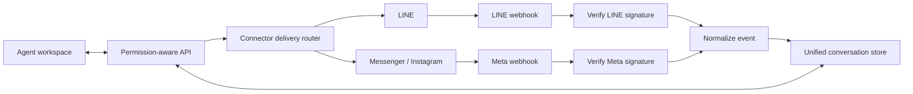

# Architecture

## Runtime

- Frontend: static HTML, CSS, and JavaScript served by Express.
- Backend: Node.js and Express.
- Persistence: SQLite with WAL, full synchronous commits, SHA-256 state verification, 100 in-database snapshots, and 50 external recovery copies.
- Connectors: LINE Messaging API and Meta Graph API.
- Realtime: Server-Sent Events trigger permission-aware client refreshes.

## Connector Flow

## Important Modules

- `src/server.js`: HTTP routes, connector dispatch, webhook endpoints, and demo identity boundary.
- `src/line.js`: LINE account verification, signature verification, and delivery.
- `src/meta.js`: Messenger and Instagram account verification, signature verification, and delivery.
- `src/store.js`: normalized accounts, conversations, messages, permissions, insights, and audit events.
- `public/app.js`: bilingual UI state, platform filtering, realtime updates, and connector forms.

## Design Boundary

Every account stores a `platform`; every conversation stores an `accountId`. Provider payloads are normalized before persistence, and outbound messages are routed by the account platform. This keeps assignment, notes, search, permissions, and analytics independent of provider APIs.

## Production Upgrade Path

- Postgres when multi-instance scaling requires tenant-scoped constraints and distributed webhook idempotency.
- OAuth onboarding for Meta assets and a guided LINE credential flow.
- Encrypted secret storage and rotation.
- Queue-backed ingestion and delivery with retry and dead-letter handling.
- Media, reactions, comments, story replies, and provider-specific message windows.
- Real authentication, organization membership, structured audit logs, and observability.
